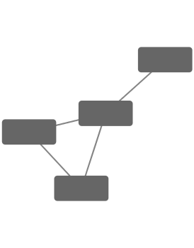
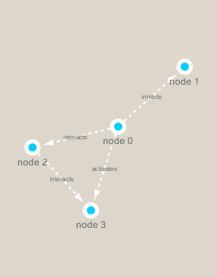

```{r setup, include=FALSE}
knitr::opts_chunk$set(echo = TRUE)
```

```{r}
library(RCy3)
library(igraph)
library(RColorBrewer)
```

```{r}
cytoscapePing()
cytoscapeVersionInfo()
```

```{r}
g <- makeSimpleIgraph()
createNetworkFromIgraph(g,"myGraph")
```

```{r}
fig<- exportImage(filename="demo", type="png", height=350)

```

```{r}
setVisualStyle("Marquee")
```

```{r}
fig<- exportImage(filename="demo_marquee", type="png", height=350)


```

```{r}
#Different Visual Style Options
styles <- getVisualStyleNames()
styles
```

```{r}
#setVisualStyle(styles[14])
#setVisualStyle(styles[18])
```

```{r}
plot(g)
```

```{r}
prok_vir_cor <-read.delim(".//virus_prok_cor_abundant.tsv", stringsAsFactors = FALSE)
head(prok_vir_cor)
```

Here we will use the igraph package to convert the co-occurrence dataframe into a network that we can send to Cytoscape. In this case our graph is undirected (so we will set directed = FALSE) since we do not have any information about the direction of the interactions from this type of data.
```{r}
g <- graph.data.frame(prok_vir_cor, directed = FALSE)
class(g)
g
#85 vertices, and 1544 edges
#network is undirected, named, and weighted
```

```{r}
plot(g)
```

```{r}
plot(g, vertex.label=NA) #remove blue text
```

```{r}
plot(g, vertex.size=3, vertex.label=NA) #nodes too big
```

```{r}
#ggplot
library(ggraph)
```

```{r}
ggraph(g, layout = 'auto') +
  geom_edge_link(alpha = 0.25) +
  geom_node_point(color="steelblue") +
  theme_graph()
```
```{r}
createNetworkFromIgraph(g,"myIgraph") # send network to Cytoscape
```

```{r}
V(g) #vertices
E(g) #edges
```

