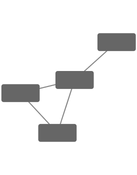
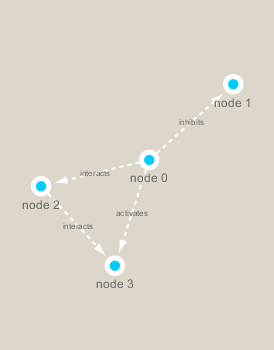

Class16 Metagenomics network
================
Kiana Miyamoto
11/20/2019

``` r
library(RCy3)
library(igraph)
```

    ## 
    ## Attaching package: 'igraph'

    ## The following objects are masked from 'package:stats':
    ## 
    ##     decompose, spectrum

    ## The following object is masked from 'package:base':
    ## 
    ##     union

``` r
library(RColorBrewer)
```

``` r
cytoscapePing()
```

    ## [1] "You are connected to Cytoscape!"

``` r
cytoscapeVersionInfo()
```

    ##       apiVersion cytoscapeVersion 
    ##             "v1"          "3.7.2"

``` r
g <- makeSimpleIgraph()
createNetworkFromIgraph(g,"myGraph")
```

    ## Loading data...
    ## Applying default style...
    ## Applying preferred layout...

    ## networkSUID 
    ##        6408

``` r
fig<- exportImage(filename="demo", type="png", height=350)
```

    ## Warning: This file already exists. A Cytoscape popup 
    ##                 will be generated to confirm overwrite.

``` r

```

<!-- -->

``` r
setVisualStyle("Marquee")
```

    ##                 message 
    ## "Visual Style applied."

``` r
fig<- exportImage(filename="demo_marquee", type="png", height=350)
```

    ## Warning: This file already exists. A Cytoscape popup 
    ##                 will be generated to confirm overwrite.

``` r

```

<!-- -->

``` r
#Different Visual Style Options
styles <- getVisualStyleNames()
styles
```

    ##  [1] "Ripple"               "Nested Network Style" "Sample1"             
    ##  [4] "Solid"                "default"              "Big Labels"          
    ##  [7] "Universe"             "BioPAX_SIF"           "size_rank"           
    ## [10] "BioPAX"               "Marquee"              "Sample3"             
    ## [13] "Minimal"              "Gradient1"            "default black"       
    ## [16] "Curved"               "Sample2"              "Directed"

``` r
#setVisualStyle(styles[14])
#setVisualStyle(styles[18])
```

``` r
plot(g)
```

<!-- -->

``` r
prok_vir_cor <-read.delim(".//virus_prok_cor_abundant.tsv", stringsAsFactors = FALSE)
head(prok_vir_cor)
```

    ##       Var1          Var2    weight
    ## 1  ph_1061 AACY020068177 0.8555342
    ## 2  ph_1258 AACY020207233 0.8055750
    ## 3  ph_3164 AACY020207233 0.8122517
    ## 4  ph_1033 AACY020255495 0.8487498
    ## 5 ph_10996 AACY020255495 0.8734617
    ## 6 ph_11038 AACY020255495 0.8740782

Here we will use the igraph package to convert the co-occurrence
dataframe into a network that we can send to Cytoscape. In this case our
graph is undirected (so we will set directed = FALSE) since we do not
have any information about the direction of the interactions from this
type of data.

``` r
g <- graph.data.frame(prok_vir_cor, directed = FALSE)
class(g)
```

    ## [1] "igraph"

``` r
g
```

    ## IGRAPH 8e59914 UNW- 845 1544 -- 
    ## + attr: name (v/c), weight (e/n)
    ## + edges from 8e59914 (vertex names):
    ##  [1] ph_1061 --AACY020068177 ph_1258 --AACY020207233 ph_3164 --AACY020207233
    ##  [4] ph_1033 --AACY020255495 ph_10996--AACY020255495 ph_11038--AACY020255495
    ##  [7] ph_11040--AACY020255495 ph_11048--AACY020255495 ph_11096--AACY020255495
    ## [10] ph_1113 --AACY020255495 ph_1208 --AACY020255495 ph_13207--AACY020255495
    ## [13] ph_1346 --AACY020255495 ph_14679--AACY020255495 ph_1572 --AACY020255495
    ## [16] ph_16045--AACY020255495 ph_1909 --AACY020255495 ph_1918 --AACY020255495
    ## [19] ph_19894--AACY020255495 ph_2117 --AACY020255495 ph_2231 --AACY020255495
    ## [22] ph_2363 --AACY020255495 ph_276  --AACY020255495 ph_2775 --AACY020255495
    ## + ... omitted several edges

``` r
#85 vertices, and 1544 edges
#network is undirected, named, and weighted
```

``` r
plot(g)
```

<!-- -->

``` r
plot(g, vertex.label=NA) #remove blue text
```

<!-- -->

``` r
plot(g, vertex.size=3, vertex.label=NA) #nodes too big
```

<!-- -->

``` r
#ggplot
library(ggraph)
```

    ## Loading required package: ggplot2

``` r
ggraph(g, layout = 'auto') +
  geom_edge_link(alpha = 0.25) +
  geom_node_point(color="steelblue") +
  theme_graph()
```

    ## Using `stress` as default layout

<!-- -->

``` r
createNetworkFromIgraph(g,"myIgraph") # send network to Cytoscape
```

    ## Loading data...
    ## Applying default style...
    ## Applying preferred layout...

    ## networkSUID 
    ##        6436

``` r
V(g) #vertices
```

    ## + 845/845 vertices, named, from 8e59914:
    ##   [1] ph_1061       ph_1258       ph_3164       ph_1033       ph_10996     
    ##   [6] ph_11038      ph_11040      ph_11048      ph_11096      ph_1113      
    ##  [11] ph_1208       ph_13207      ph_1346       ph_14679      ph_1572      
    ##  [16] ph_16045      ph_1909       ph_1918       ph_19894      ph_2117      
    ##  [21] ph_2231       ph_2363       ph_276        ph_2775       ph_2798      
    ##  [26] ph_3217       ph_3336       ph_3493       ph_3541       ph_3892      
    ##  [31] ph_4194       ph_4602       ph_4678       ph_484        ph_4993      
    ##  [36] ph_4999       ph_5001       ph_5010       ph_5286       ph_5287      
    ##  [41] ph_5302       ph_5321       ph_5643       ph_6441       ph_654       
    ##  [46] ph_6954       ph_7389       ph_7920       ph_8039       ph_8695      
    ## + ... omitted several vertices

``` r
E(g) #edges
```

    ## + 1544/1544 edges from 8e59914 (vertex names):
    ##  [1] ph_1061 --AACY020068177 ph_1258 --AACY020207233 ph_3164 --AACY020207233
    ##  [4] ph_1033 --AACY020255495 ph_10996--AACY020255495 ph_11038--AACY020255495
    ##  [7] ph_11040--AACY020255495 ph_11048--AACY020255495 ph_11096--AACY020255495
    ## [10] ph_1113 --AACY020255495 ph_1208 --AACY020255495 ph_13207--AACY020255495
    ## [13] ph_1346 --AACY020255495 ph_14679--AACY020255495 ph_1572 --AACY020255495
    ## [16] ph_16045--AACY020255495 ph_1909 --AACY020255495 ph_1918 --AACY020255495
    ## [19] ph_19894--AACY020255495 ph_2117 --AACY020255495 ph_2231 --AACY020255495
    ## [22] ph_2363 --AACY020255495 ph_276  --AACY020255495 ph_2775 --AACY020255495
    ## [25] ph_2798 --AACY020255495 ph_3217 --AACY020255495 ph_3336 --AACY020255495
    ## [28] ph_3493 --AACY020255495 ph_3541 --AACY020255495 ph_3892 --AACY020255495
    ## + ... omitted several edges
