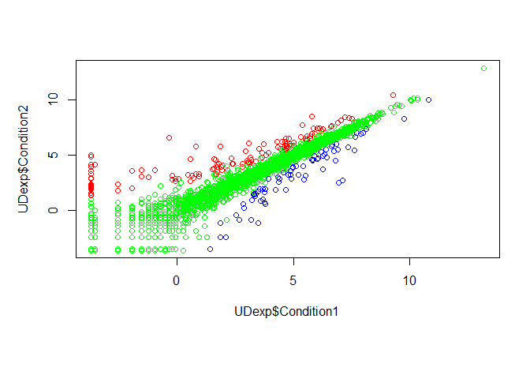

Class05 Data Visualization
================
ktmiy
2019-11-01

``` r
#Class 5 Data Visualization
#normal distribution of 1000 entries, with mean=0, sd=1
x<-rnorm(1000)
#checking if vector
is.vector(x)
```

    ## [1] TRUE

``` r
#how many entries in x
length(x)
```

    ## [1] 1000

``` r
#average
mean(x)
```

    ## [1] 0.006299447

``` r
#standard deviation
sd(x)
```

    ## [1] 1.044747

``` r
#min, 1st quar, median, mean, 3rd quar, max
summary(x)
```

    ##      Min.   1st Qu.    Median      Mean   3rd Qu.      Max. 
    ## -3.980658 -0.644583  0.027496  0.006299  0.681686  3.536839

``` r
#box&whisker plot
boxplot(x)
```

<!-- -->

``` r
#histogram
hist(x)
```

<!-- -->

``` r
hist(x,breaks=3)
```

<!-- -->

``` r
hist(x,breaks=30)
#shows all data points along the distribution
rug(x)
```

<!-- -->

``` r
#Section 2
#set working directory
setwd("~/BGGN213_Bioinformatics/class05/bimm143_05_rstats")
#read in txt file
weight<-read.table("weight_chart.txt", header=TRUE)

#plot
plot(weight)
```

<!-- -->

``` r
#overlay line plot
plot(weight$Age, weight$Weight, typ="o", pch=15)
```

<!-- -->

``` r
#color line blue, add access labels, square points, y-axis manipulation, title
plot(weight$Age, weight$Weight, typ="o", pch=15, 
     cex=1.5, lwd=2, ylim=c(2,10), 
     xlab="Age(month)", ylab="Weight(kg)",
     main="Baby weight with age", col = "blue")
```

<!-- -->

``` r
#Section 2B
mouse<-read.table("~/BGGN213_Bioinformatics/class05/bimm143_05_rstats/feature_counts.txt", header=TRUE, sep="\t")
#read.delim("~/BGGN213_Bioinformatics/class05/bimm143_05_rstats/") )
barplot(mouse$Count)
```

<!-- -->

``` r
#or barplot(mouse[,2])
#use par()$mar to check current margin settings
par(mar=c(3, 11, 4, 2))
barplot(mouse$Count, horiz=TRUE, ylab="", 
        main="Features", las=1, names.arg=mouse$Feature, xlim=c(0,80000))
```

<!-- -->

``` r
#creating histograms
x<- c(rnorm(10000), rnorm(10000)+4)
hist(x,breaks=50)
```

<!-- -->

``` r
#Section 3A-changing colors
gender<- read.delim("~/BGGN213_Bioinformatics/class05/bimm143_05_rstats/male_female_counts.txt", header=TRUE)
barplot(gender$Count, names.arg=gender$Sample, col=rainbow(nrow(gender)), las=2, ylab="Counts")
```

<!-- -->

``` r
#males v female colors
par(mar=c(8, 5, 4, 2))
barplot(gender$Count, names.arg=gender$Sample, col=c("blue2","red2"), las=2, ylab="Counts")
```

<!-- -->

``` r
#Coloring by value
UDexp<-read.delim("~/BGGN213_Bioinformatics/class05/bimm143_05_rstats/up_down_expression.txt")
UDrow<-nrow(UDexp)
table(UDexp$State)
```

    ## 
    ##       down unchanging         up 
    ##         72       4997        127

``` r
plot(UDexp$Condition1,UDexp$Condition2, col=UDexp$State)
```

<!-- -->

``` r
palette()
```

    ## [1] "black"   "red"     "green3"  "blue"    "cyan"    "magenta" "yellow" 
    ## [8] "gray"

``` r
levels(UDexp$State)
```

    ## [1] "down"       "unchanging" "up"

``` r
palette(c("blue","green","red"))
plot(UDexp$Condition1,UDexp$Condition2, col=UDexp$State)
```

<!-- -->

``` r
#Section3C
meth<-read.delim("~/BGGN213_Bioinformatics/class05/bimm143_05_rstats/expression_methylation.txt")
plot(meth$gene.meth,meth$expression)
```

<!-- -->

``` r
dCols=densCols(meth$gene.meth, meth$expression)
plot(meth$gene.meth,meth$expression, col=dCols, pch=20)
```

<!-- -->
