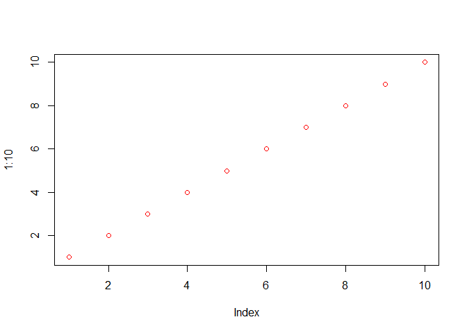

Class 7 R functions and packages
================
Kiana Miyamoto
10/23/2019

## Revisit our functions from last day

``` r
source("http://tinyurl.com/rescale-R")
```

## Let’s try our rescale() function from last day

``` r
rescale(1:10)
```

    ##  [1] 0.0000000 0.1111111 0.2222222 0.3333333 0.4444444 0.5555556 0.6666667
    ##  [8] 0.7777778 0.8888889 1.0000000

``` r
#rescale(c(3,10,NA,7,"barry"))
```

``` r
#rescale2(c(3,10,NA,"barry"))
```

is.numeric()

## Write a function both\_na()

We want to write a function, called both\_na(), that counts how many
positions in two input vectors, x and y, both have a missing value

``` r
# Should we start like this? No!
both_na <- function(x, y) {
 # something goes here? body
}
```

``` r
## from StackOverflow
# Lets define an example x and y
x <- c( 1, 2, NA, 3, NA)
y <- c(NA, 3, NA, 3, 4)
is.na(x)
```

    ## [1] FALSE FALSE  TRUE FALSE  TRUE

``` r
is.na(y)
```

    ## [1]  TRUE FALSE  TRUE FALSE FALSE

``` r
which(is.na(x))
```

    ## [1] 3 5

``` r
both_na<-function(x,y){
  sum(is.na(x)&is.na(y))
}
both_na(x,y)
```

    ## [1] 1

``` r
x <- c(NA, NA, NA)
y1 <- c( 1, NA, NA)
y2 <- c( 1, NA, NA, NA)
y3<-c(1, NA, NA, NA, NA, NA)
both_na(x,y1)
```

    ## [1] 2

``` r
## what will this return?
both_na(x,y2)
```

    ## Warning in is.na(x) & is.na(y): longer object length is not a multiple of
    ## shorter object length

    ## [1] 3

``` r
both_na(x,y3)
```

    ## [1] 5

``` r
plot(1:10,col="red")
```

<!-- -->

``` r
plot(1:10,col=c("red","green","blue"))
```

<!-- -->

``` r
both_na2<- function(x,y) {
  if(length(x) != length(y)) {
    stop("Input x and y should be the same legnth")
  }
  sum(is.na(x) & is.na(y))
}
both_na2(x,y1)
```

    ## [1] 2

``` r
#both_na2(x,y2)
#both_na2(x,y3)
```

``` r
# student 1
s1 <-c(100, 100, 100, 100, 100, 100, 100, 90)
# student 2
s2<-c(100, NA, 90, 90, 90, 90, 97, 80)
# now grade all students in an example class
url <- "https://tinyurl.com/gradeinput"

s1r<-s1[-which.min(s1)]
mean(s1r)
```

    ## [1] 100

``` r
s2[is.na(s2)]<-0

s2r<-s2[-which.min(s2)]
mean(s2r)
```

    ## [1] 91

``` r
grade<- function(x) {
  x[is.na(x)]<-0
xr<-x[-which.min(x)]
mean(xr)
}
grade(s1)
```

    ## [1] 100

``` r
grade(s2)
```

    ## [1] 91

``` r
grade(url)
```

    ## Warning in which.min(x): NAs introduced by coercion

    ## Warning in mean.default(xr): argument is not numeric or logical: returning
    ## NA

    ## [1] NA
