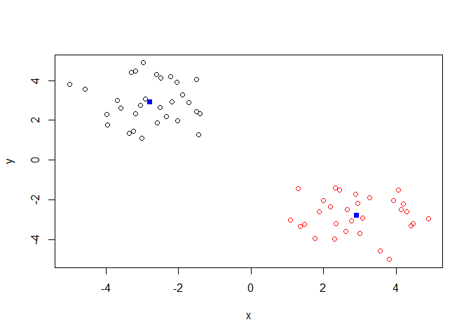

class08
================
Kiana Miyamoto
10/25/2019

\#\#K-means example We will make up some data to cluster, baby steps ;-)

``` r
# Generate some example data for clustering
tmp <- c(rnorm(30,-3), rnorm(30,3))
x <- cbind(x=tmp, y=rev(tmp))
plot(x)
```

<!-- -->

``` r
# k-means algorithm with 5 centers, run 20 times
k<-kmeans(x, centers=2, nstart=20)
k
```

    ## K-means clustering with 2 clusters of sizes 30, 30
    ## 
    ## Cluster means:
    ##           x         y
    ## 1 -2.779114  2.915980
    ## 2  2.915980 -2.779114
    ## 
    ## Clustering vector:
    ##  [1] 1 1 1 1 1 1 1 1 1 1 1 1 1 1 1 1 1 1 1 1 1 1 1 1 1 1 1 1 1 1 2 2 2 2 2
    ## [36] 2 2 2 2 2 2 2 2 2 2 2 2 2 2 2 2 2 2 2 2 2 2 2 2 2
    ## 
    ## Within cluster sum of squares by cluster:
    ## [1] 57.78453 57.78453
    ##  (between_SS / total_SS =  89.4 %)
    ## 
    ## Available components:
    ## 
    ## [1] "cluster"      "centers"      "totss"        "withinss"    
    ## [5] "tot.withinss" "betweenss"    "size"         "iter"        
    ## [9] "ifault"

Q. How many points are in each cluster? 30

``` r
print(k$size)
```

    ## [1] 30 30

Q. What ‘component’ of your result object details - cluster size? 30, 30
- cluster assignment/membership? clustering vector - cluster center?
cluster means

Plot x colored by the kmeans cluster assignment and add cluster centers
as blue points

``` r
k$cluster
```

    ##  [1] 1 1 1 1 1 1 1 1 1 1 1 1 1 1 1 1 1 1 1 1 1 1 1 1 1 1 1 1 1 1 2 2 2 2 2
    ## [36] 2 2 2 2 2 2 2 2 2 2 2 2 2 2 2 2 2 2 2 2 2 2 2 2 2

``` r
table(k$cluster)
```

    ## 
    ##  1  2 
    ## 30 30

``` r
plot(x, col=k$cluster)
points(k$centers, col="blue", pch=15)
```

<!-- -->

## Hierarchical clustering in R

``` r
hc<- hclust(dist(x))
hc
```

    ## 
    ## Call:
    ## hclust(d = dist(x))
    ## 
    ## Cluster method   : complete 
    ## Distance         : euclidean 
    ## Number of objects: 60

``` r
plot(hc)
abline(h=6,col="red")
```

<!-- -->

``` r
#cutree(hc, h=6)
```

``` r
grps<-cutree(hc,h=4)
table(grps)
```

    ## grps
    ##  1  2  3  4 
    ## 25  5 25  5

``` r
plot(hc)
abline(h=6, col="red")
```

<!-- -->

``` r
cutree(hc,k=2)
```

    ##  [1] 1 1 1 1 1 1 1 1 1 1 1 1 1 1 1 1 1 1 1 1 1 1 1 1 1 1 1 1 1 1 2 2 2 2 2
    ## [36] 2 2 2 2 2 2 2 2 2 2 2 2 2 2 2 2 2 2 2 2 2 2 2 2 2

``` r
grps<-cutree(hc,h=4)
plot(x,col=grps)
```

<!-- -->

``` r
grps<-cutree(hc,k=2)
plot(x,col=grps)
```

<!-- -->

``` r
# Step 1. Generate some example data for clustering
x <- rbind(
 matrix(rnorm(100, mean=0, sd = 0.3), ncol = 2), # c1
 matrix(rnorm(100, mean = 1, sd = 0.3), ncol = 2), # c2
 matrix(c(rnorm(50, mean = 1, sd = 0.3), # c3
 rnorm(50, mean = 0, sd = 0.3)), ncol = 2))
colnames(x) <- c("x", "y")
# Step 2. Plot the data without clustering
plot(x)
```

<!-- -->

``` r
# Step 3. Generate colors for known clusters
# (just so we can compare to hclust results)
col <- as.factor( rep(c("c1","c2","c3"), each=50) )
plot(x, col=col)
```

<!-- --> Q. Use the
dist(), hclust(), plot() and cutree() functions to return 2 and 3
clusters

``` r
hc<-hclust(dist(x))
plot(hc)
```

<!-- -->

``` r
k2<-cutree(hc,k=2)
plot(x,col=k2)
```

<!-- -->

``` r
k3<-cutree(hc,k=3)
plot(x,col=k3)
```

<!-- -->

Q. How does this compare to your known ‘col’ groups

``` r
table(k2,col)#crosstabs
```

    ##    col
    ## k2  c1 c2 c3
    ##   1 50  9 29
    ##   2  0 41 21

``` r
table(k3,col)
```

    ##    col
    ## k3  c1 c2 c3
    ##   1 22  9 29
    ##   2 28  0  0
    ##   3  0 41 21

\#\#How to do PCA in R

``` r
mydata<- read.csv("https://tinyurl.com/expression-CSV",row.names=1)
head(mydata)
```

    ##        wt1 wt2  wt3  wt4 wt5 ko1 ko2 ko3 ko4 ko5
    ## gene1  439 458  408  429 420  90  88  86  90  93
    ## gene2  219 200  204  210 187 427 423 434 433 426
    ## gene3 1006 989 1030 1017 973 252 237 238 226 210
    ## gene4  783 792  829  856 760 849 856 835 885 894
    ## gene5  181 249  204  244 225 277 305 272 270 279
    ## gene6  460 502  491  491 493 612 594 577 618 638

``` r
pca<- prcomp(t(mydata), scale=TRUE)
attributes(pca)
```

    ## $names
    ## [1] "sdev"     "rotation" "center"   "scale"    "x"       
    ## 
    ## $class
    ## [1] "prcomp"

``` r
## lets do PCA
pca <- prcomp(t(mydata), scale=TRUE)
pca$x[,1]
```

    ##       wt1       wt2       wt3       wt4       wt5       ko1       ko2 
    ## -9.697374 -9.138950 -9.054263 -8.731483 -9.006312  8.846999  9.213885 
    ##       ko3       ko4       ko5 
    ##  9.458412  8.883412  9.225673

``` r
## A basic PC1 vs PC2 2-D plot
plot(pca$x[,1], pca$x[,2]) 
```

<!-- -->

``` r
summary(pca)
```

    ## Importance of components:
    ##                           PC1    PC2     PC3     PC4     PC5     PC6
    ## Standard deviation     9.6237 1.5198 1.05787 1.05203 0.88062 0.82545
    ## Proportion of Variance 0.9262 0.0231 0.01119 0.01107 0.00775 0.00681
    ## Cumulative Proportion  0.9262 0.9493 0.96045 0.97152 0.97928 0.98609
    ##                            PC7     PC8     PC9      PC10
    ## Standard deviation     0.80111 0.62065 0.60342 3.348e-15
    ## Proportion of Variance 0.00642 0.00385 0.00364 0.000e+00
    ## Cumulative Proportion  0.99251 0.99636 1.00000 1.000e+00

``` r
## Variance captured per PC
pca.var <- pca$sdev^2 
pca.var.per <- round(pca.var/sum(pca.var)*100, 1) 
pca.var.per
```

    ##  [1] 92.6  2.3  1.1  1.1  0.8  0.7  0.6  0.4  0.4  0.0

``` r
barplot(pca.var.per, main="Scree Plot",
 xlab="Principal Component", ylab="Percent Variation")
```

<!-- -->

``` r
plot(pca) #same thing
```

<!-- -->

``` r
## A vector of colors for wt and ko samples
colvec <- as.factor( substr( colnames(mydata), 1, 2) )
plot(pca$x[,1], pca$x[,2], col=colvec, pch=16,
 xlab=paste0("PC1 (", pca.var.per[1], "%)"),
 ylab=paste0("PC2 (", pca.var.per[2], "%)")) 
```

<!-- -->
