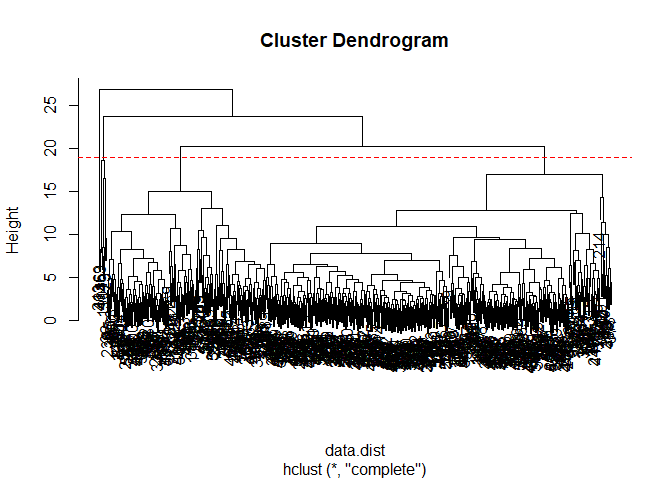
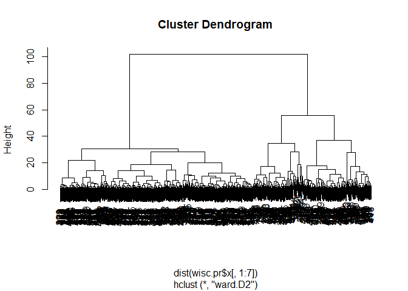
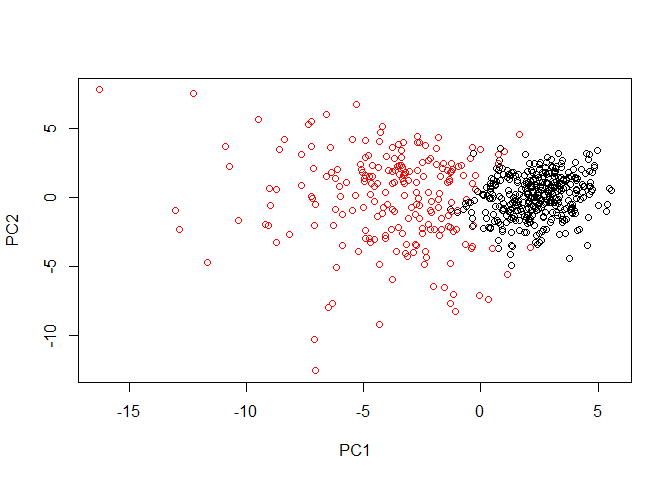
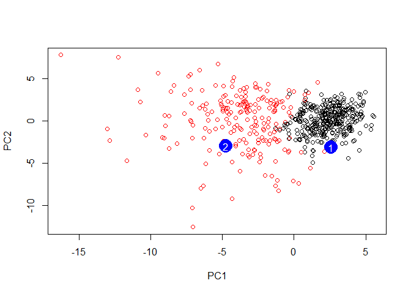

Class 9 Unsupervised Learning
================
Kiana Miyamoto
10/30/2019

``` r
wisc.df<-read.csv("~/BGGN213_Bioinformatics/class09/WisconsinCancer.csv")
#head(wisc.df)
```

Here we examine data from 569 patient samples.

``` r
table(wisc.df$diagnosis)
```

    ## 
    ##   B   M 
    ## 357 212

``` r
x<-table(wisc.df$diagnosis)
```

In this dataset we have 357 benign and 212 malignant.

``` r
wisc.data<-as.matrix(wisc.df[,3:32])
```

> Q. How many variables/features in the data are suffixed with \_mean?

``` r
colnames(wisc.df)
```

    ##  [1] "id"                      "diagnosis"              
    ##  [3] "radius_mean"             "texture_mean"           
    ##  [5] "perimeter_mean"          "area_mean"              
    ##  [7] "smoothness_mean"         "compactness_mean"       
    ##  [9] "concavity_mean"          "concave.points_mean"    
    ## [11] "symmetry_mean"           "fractal_dimension_mean" 
    ## [13] "radius_se"               "texture_se"             
    ## [15] "perimeter_se"            "area_se"                
    ## [17] "smoothness_se"           "compactness_se"         
    ## [19] "concavity_se"            "concave.points_se"      
    ## [21] "symmetry_se"             "fractal_dimension_se"   
    ## [23] "radius_worst"            "texture_worst"          
    ## [25] "perimeter_worst"         "area_worst"             
    ## [27] "smoothness_worst"        "compactness_worst"      
    ## [29] "concavity_worst"         "concave.points_worst"   
    ## [31] "symmetry_worst"          "fractal_dimension_worst"
    ## [33] "X"

``` r
grep("_mean", colnames(wisc.df), value=TRUE)
```

    ##  [1] "radius_mean"            "texture_mean"          
    ##  [3] "perimeter_mean"         "area_mean"             
    ##  [5] "smoothness_mean"        "compactness_mean"      
    ##  [7] "concavity_mean"         "concave.points_mean"   
    ##  [9] "symmetry_mean"          "fractal_dimension_mean"

``` r
length(grep("_mean", colnames(wisc.df), value=TRUE))
```

    ## [1] 10

``` r
colMeans(wisc.data)
```

    ##             radius_mean            texture_mean          perimeter_mean 
    ##            1.412729e+01            1.928965e+01            9.196903e+01 
    ##               area_mean         smoothness_mean        compactness_mean 
    ##            6.548891e+02            9.636028e-02            1.043410e-01 
    ##          concavity_mean     concave.points_mean           symmetry_mean 
    ##            8.879932e-02            4.891915e-02            1.811619e-01 
    ##  fractal_dimension_mean               radius_se              texture_se 
    ##            6.279761e-02            4.051721e-01            1.216853e+00 
    ##            perimeter_se                 area_se           smoothness_se 
    ##            2.866059e+00            4.033708e+01            7.040979e-03 
    ##          compactness_se            concavity_se       concave.points_se 
    ##            2.547814e-02            3.189372e-02            1.179614e-02 
    ##             symmetry_se    fractal_dimension_se            radius_worst 
    ##            2.054230e-02            3.794904e-03            1.626919e+01 
    ##           texture_worst         perimeter_worst              area_worst 
    ##            2.567722e+01            1.072612e+02            8.805831e+02 
    ##        smoothness_worst       compactness_worst         concavity_worst 
    ##            1.323686e-01            2.542650e-01            2.721885e-01 
    ##    concave.points_worst          symmetry_worst fractal_dimension_worst 
    ##            1.146062e-01            2.900756e-01            8.394582e-02

``` r
round(apply(wisc.data,2,sd), 3)
```

    ##             radius_mean            texture_mean          perimeter_mean 
    ##                   3.524                   4.301                  24.299 
    ##               area_mean         smoothness_mean        compactness_mean 
    ##                 351.914                   0.014                   0.053 
    ##          concavity_mean     concave.points_mean           symmetry_mean 
    ##                   0.080                   0.039                   0.027 
    ##  fractal_dimension_mean               radius_se              texture_se 
    ##                   0.007                   0.277                   0.552 
    ##            perimeter_se                 area_se           smoothness_se 
    ##                   2.022                  45.491                   0.003 
    ##          compactness_se            concavity_se       concave.points_se 
    ##                   0.018                   0.030                   0.006 
    ##             symmetry_se    fractal_dimension_se            radius_worst 
    ##                   0.008                   0.003                   4.833 
    ##           texture_worst         perimeter_worst              area_worst 
    ##                   6.146                  33.603                 569.357 
    ##        smoothness_worst       compactness_worst         concavity_worst 
    ##                   0.023                   0.157                   0.209 
    ##    concave.points_worst          symmetry_worst fractal_dimension_worst 
    ##                   0.066                   0.062                   0.018

``` r
wisc.pr <- prcomp(wisc.data, scale=TRUE )
summary(wisc.pr)
```

    ## Importance of components:
    ##                           PC1    PC2     PC3     PC4     PC5     PC6
    ## Standard deviation     3.6444 2.3857 1.67867 1.40735 1.28403 1.09880
    ## Proportion of Variance 0.4427 0.1897 0.09393 0.06602 0.05496 0.04025
    ## Cumulative Proportion  0.4427 0.6324 0.72636 0.79239 0.84734 0.88759
    ##                            PC7     PC8    PC9    PC10   PC11    PC12
    ## Standard deviation     0.82172 0.69037 0.6457 0.59219 0.5421 0.51104
    ## Proportion of Variance 0.02251 0.01589 0.0139 0.01169 0.0098 0.00871
    ## Cumulative Proportion  0.91010 0.92598 0.9399 0.95157 0.9614 0.97007
    ##                           PC13    PC14    PC15    PC16    PC17    PC18
    ## Standard deviation     0.49128 0.39624 0.30681 0.28260 0.24372 0.22939
    ## Proportion of Variance 0.00805 0.00523 0.00314 0.00266 0.00198 0.00175
    ## Cumulative Proportion  0.97812 0.98335 0.98649 0.98915 0.99113 0.99288
    ##                           PC19    PC20   PC21    PC22    PC23   PC24
    ## Standard deviation     0.22244 0.17652 0.1731 0.16565 0.15602 0.1344
    ## Proportion of Variance 0.00165 0.00104 0.0010 0.00091 0.00081 0.0006
    ## Cumulative Proportion  0.99453 0.99557 0.9966 0.99749 0.99830 0.9989
    ##                           PC25    PC26    PC27    PC28    PC29    PC30
    ## Standard deviation     0.12442 0.09043 0.08307 0.03987 0.02736 0.01153
    ## Proportion of Variance 0.00052 0.00027 0.00023 0.00005 0.00002 0.00000
    ## Cumulative Proportion  0.99942 0.99969 0.99992 0.99997 1.00000 1.00000

``` r
biplot(wisc.pr)
```

<!-- --> Plot PC1 vs
PC2 and color by M/B cancer/non-cancer diagnosis

``` r
plot(wisc.pr$x[,1],wisc.pr$x[,2], col=wisc.df$diagnosis,xlab="PC1", ylab="PC2" )
```

<!-- -->
Black=benign, Red=malignant

``` r
plot(wisc.pr$x[,1], wisc.pr$x[,3], col=wisc.df$diagnosis, xlab="PC1", ylab="PC3")
```

<!-- -->

``` r
x<-summary(wisc.pr)
x$importance[,"PC1"]
```

    ##     Standard deviation Proportion of Variance  Cumulative Proportion 
    ##               3.644394               0.442720               0.442720

The first PC captures \`r x$importance\[2,“PC1”\] \*100 of the original
variance in the dataset.

``` r
which(x$importance[3,]>0.7)[1]
```

    ## PC3 
    ##   3

``` r
data.scaled<- scale(wisc.data)
data.dist<- dist(data.scaled)
wisc.hclust<- hclust(data.dist)
```

``` r
plot(wisc.hclust)
abline(h=19,col="red", lty=2)
```

<!-- -->

``` r
wisc.hclust.clusters<-cutree(wisc.hclust, k=4)
```

``` r
table(wisc.hclust.clusters,wisc.df$diagnosis)
```

    ##                     
    ## wisc.hclust.clusters   B   M
    ##                    1  12 165
    ##                    2   2   5
    ##                    3 343  40
    ##                    4   0   2

``` r
wisc.km<-kmeans(wisc.data, centers=2, nstart=20)
```

``` r
table(wisc.km$cluster, wisc.df$diagnosis)
```

    ##    
    ##       B   M
    ##   1   1 130
    ##   2 356  82

``` r
table(wisc.km$cluster, wisc.hclust.clusters)
```

    ##    wisc.hclust.clusters
    ##       1   2   3   4
    ##   1 109   2  18   2
    ##   2  68   5 365   0

``` r
#Take the first 7PCs
wisc.pr.hclust<-hclust(dist(wisc.pr$x[,1:7]), method="ward.D2")
plot(wisc.pr.hclust)
```

<!-- -->

``` r
grps<-cutree(wisc.pr.hclust,k=2)
table(grps)
```

    ## grps
    ##   1   2 
    ## 216 353

``` r
table(grps, wisc.df$diagnosis)
```

    ##     
    ## grps   B   M
    ##    1  28 188
    ##    2 329  24

``` r
plot(wisc.pr$x[,1:2], col=grps)
```

<!-- -->

``` r
plot(wisc.pr$x[,1:2], col=wisc.df$diagnosis)
```

<!-- -->

``` r
#Reordering the factors
g<-as.factor(grps)
levels(g)
```

    ## [1] "1" "2"

``` r
g<-relevel(g,2)
levels(g)
```

    ## [1] "2" "1"

``` r
plot(wisc.pr$x[,1:2], col=g)
```

<!-- -->

``` r
## Use the distance along the first 7 PCs for clustering
wisc.pr.hclust<- hclust(dist(wisc.pr$x[,1:7]), method="ward.D2")
```

``` r
wisc.pr.hclust.clusters<- cutree(wisc.pr.hclust,k=2)
table(wisc.pr.hclust.clusters, wisc.df$diagnosis)
```

    ##                        
    ## wisc.pr.hclust.clusters   B   M
    ##                       1  28 188
    ##                       2 329  24

``` r
table(wisc.km$cluster, wisc.df$diagnosis)
```

    ##    
    ##       B   M
    ##   1   1 130
    ##   2 356  82

``` r
table(wisc.hclust.clusters, wisc.df$diagnosis)
```

    ##                     
    ## wisc.hclust.clusters   B   M
    ##                    1  12 165
    ##                    2   2   5
    ##                    3 343  40
    ##                    4   0   2

``` r
#url <- "new_samples.csv"
url <- "https://tinyurl.com/new-samples-CSV"
new <- read.csv(url)
npc <- predict(wisc.pr, newdata=new)
npc
```

    ##            PC1       PC2        PC3        PC4       PC5        PC6
    ## [1,]  2.576616 -3.135913  1.3990492 -0.7631950  2.781648 -0.8150185
    ## [2,] -4.754928 -3.009033 -0.1660946 -0.6052952 -1.140698 -1.2189945
    ##             PC7        PC8       PC9       PC10      PC11      PC12
    ## [1,] -0.3959098 -0.2307350 0.1029569 -0.9272861 0.3411457  0.375921
    ## [2,]  0.8193031 -0.3307423 0.5281896 -0.4855301 0.7173233 -1.185917
    ##           PC13     PC14      PC15       PC16        PC17        PC18
    ## [1,] 0.1610764 1.187882 0.3216974 -0.1743616 -0.07875393 -0.11207028
    ## [2,] 0.5893856 0.303029 0.1299153  0.1448061 -0.40509706  0.06565549
    ##             PC19       PC20       PC21       PC22       PC23       PC24
    ## [1,] -0.08802955 -0.2495216  0.1228233 0.09358453 0.08347651  0.1223396
    ## [2,]  0.25591230 -0.4289500 -0.1224776 0.01732146 0.06316631 -0.2338618
    ##             PC25         PC26         PC27        PC28         PC29
    ## [1,]  0.02124121  0.078884581  0.220199544 -0.02946023 -0.015620933
    ## [2,] -0.20755948 -0.009833238 -0.001134152  0.09638361  0.002795349
    ##              PC30
    ## [1,]  0.005269029
    ## [2,] -0.019015820

``` r
plot(wisc.pr$x[,1:2], col=g)
points(npc[,1], npc[,2], col="blue", pch=16, cex=3)
text(npc[,1], npc[,2], c(1,2), col="white")
```

<!-- -->
